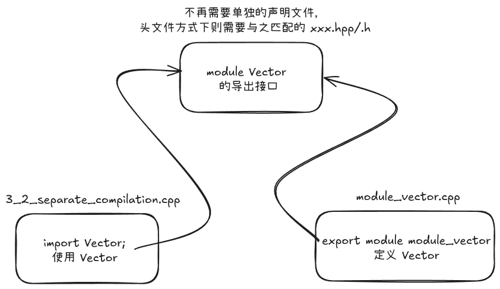

@page modularity 第 3 章 模块化

# 第 3 章 模块化

C++ 包含许多独立开发内容。为了清晰确定各个部件、组成、定义等，需要将每个部分的接口与实现分离开来。正如本项目正在做的，每个章节作为一个子项目，每个子项目中又包含
`include` 和 `src` 目录，分别用于存放接口和实现，最后通过 `CMakeLists.txt` 进行连接。

C++ 通过多种机制支持模块化编程，旨在提高代码的可维护性、可重用性并缩短编译时间。本章主要介绍分离编译、命名空间以及函数参数与返回值。

## 3.1 引言（Introduction）

---
模块化是有效管理大型项目的核心。C++ 传统上通过头文件和源文件实现分离编译，在语法层面 C++ 通过声明来表示接口。*声明*
指定了使用一个函数´或一个类型所需的所有信息。但是注意：一个实体（如函数或类型）允许有很多声明，但只有一个定义。

## 3.2 分离编译（Separate Compilation）

---
何谓“分离编译”？即用户代码仅能看到所用类型和函数声明，而不必知道它们的具体实现。分离编译有两种实现方式：

- **头文件**：将声明放入独立文件，然后通过 `#include` 以文本方式将其包含到需要声明的地方。
- **模块**：定义 `module` 文件，独立地编译它们，然后在需要时 `import` 它们。在 `import` 对应 `module` 时，只有其中显式
  `export` 的声明才会被导出。

上述两种方式都是将一个程序组织划分开来，成为一组半独立代码片段。由此可以减少编译时间，同时强制性将程序中逻辑部分分离开来，降低发生错误概率。例如：库通常就是一组代码片段的集合。

使用头文件组织代码从 C 语言时代就存在，模块技术则是在 C++20 中出现的新特性，对比前者提供实质性的优势，对改善代码组织和编译耗时都有好处。但是非常可惜，在编写该项目时，Linux
平台下编译器对模块化支持还存在一些问题，原因在于 Clang 与 GCC 的编译实现都还处于实验阶段。因此暂时还是依旧使用头文件来组织，仅在模块化介绍时使用该特性。

程序组织的最佳实践是将一个完整的程序分成多个独立的部分，每个部分则包含一系列定义了良好依赖的模块集合，同时通过分离编译充分利用模块化。

一个可以单独编译的 `.cpp` 文件（包含其 `#include` 的头文件）被称为一个*翻译单元*。

在本示例 `Vector.cpp`、`Vector.hpp`、`3_2_separate_compilation.cpp` 以及 `module_vector.cpp` 中，大致组织结构为：


头文件从 C 语言时代就开始，作为一种传统方法，它具有明显的缺点：

1. *编译时间*：如果存在许多翻译单元，同时每个翻译单元中均包含 `#include "header.h"`，那么编译器每次编译一个翻译单元都要编译
   `header.h` 这个文本，这将会导致编译时间的增加。
2. *依赖顺序*：如果一个头文件中包含了另一个头文件，那么编译器将会按照 `#include`
   的顺序依次编译它们。因此，如果一个头文件依赖于另一个头文件，那么必须保证该头文件在编译前被编译。
3. *不协调*：如果在一个文件中定义了一个实体，同时是在另一个文件中定义了一个稍微不同的实体，那么在有意或无意地在两个源文件中定义了同一个实体时，或者引用头文件顺序不一致时，可能导致程序崩溃或出现难以察觉的错误。
4. *传染性*：因为为了表达某个声明，其代码必须出现在头文件中，这一方面会导致代码膨胀；另一方面头文件为了完成声明必不可少的需要
   `#include` 其他头文件，这会导致头文件用户（无论是有意还是无意）中依赖头文件包含的实现细节。

对此，在 C++20 中，**module** 特性终于加入，让我们重新梳理上述例子，最终得到模块化的效果：`module_vector.cpp`，其组织结构大致为：



> 头文件与模块的区别：
> - 模块只需被编译一次，大幅度缩短编译时间；
> - 两个模块 `import` 顺序不影响其含义；
> - `import` 没有传染性，在模块内部 `import` 或者 `#include` 其他内容时，模块使用者并不会隐式获得这些模块的访问权，必须通过
    > `export` 关键字显式导出；
>
> 模块大幅度缩短编译时间在于，模块只导出接口，但头文件需要传递所有直接或间接的信息给编译器。同时定义一个模块时，不再需要将实现与声明分开写成两个文件，如果为了代码组织，可将模块单独存放于
> `module` 目录内。


`module` 细节之**全局模块片段**，C++ 模块想要解决的一个大问题是：

旧式头文件存在：
- 旧式头文件会把很多内容“直接注入“当前翻译单元；
- 可能会带来宏污染、重复包含、命名冲突、依赖传播等问题。

模块希望做到：
- 接口边界清晰；
- 依赖关系更可控；
- 编译器能更好地理解哪些内容属于模块，哪些内容只是实现细节。

那么在这里我们就要使用到全局模块片段，实例如下：

```c++
module; /**< 进入全局模块片段，定义旧式头文件、宏等 */
#include <iostream>
#include <stdexcept> /**< 旧式接口 */

module error_handling; /**< 声明正式模块区域 */
```

上述相当于告诉编译器：前面这些旧式头文件只是准备工作，不要将其这个模块等核心定义内容。这只是一个过渡期，如果模块主体内放传统  `#include` 语义，造成模糊块边界。

### 示例：

在 `3_modularity` 示例中，我们将 `Vector` 类的声明放在 `Vector.hpp` 中，而将其实现放在 `Vector.cpp` 中。

代码参考：

- [Vector.hpp](../3_modularity/include/Vector.hpp)
- [Vector.cpp](../3_modularity/src/Vector.cpp)
- [3_2_separate_compilation.cpp](../3_modularity/src/3_2_separate_compilation.cpp)
- [module_vector.cpp](../3_modularity/module/module_vector.cpp)

### 涉及的函数：

- **`Vector`**
	- **签名**: `ch3_separate_compilation_impl::Vector`
	- **用途**: 演示传统头文件方式的分离编译类。
- **`sqrt_sum(const Vector&)`**
	- **签名**: `double ch3_separate_compilation_impl::sqrt_sum(const Vector& v)`
	- **用途**: 计算向量元素平方根总和，演示头文件方式的分离编译。
- **`module_sqrt_sum(const ModularVector&)`**
	- **签名**: `double ch3_separate_compilation_impl::module_sqrt_sum(const ModularVector& v)`
	- **用途**: 计算模块化向量元素平方根总和，演示 C++20 模块化。
- **`tutorial_separate_compilation()`**
	- **签名**: `void tutorial_separate_compilation()`
	- **用途**: 3.2 节教程入口，对比头文件与模块化分离编译。

## 3.3 命名空间（Namespaces）

---
命名空间用于将逻辑相关的组件组织在一起，并防止命名冲突。其表达为：一方面某些声明属于一个整体，另一方面该名字不会与其他命名空间中的名字冲突。

> 事实上，当我第一次接触到 C++，就对每次输出需要 `std::` 前缀感到烦恼，学会 `using namespace std` “偷懒”，但是随着逐渐理解其
> C++ 特性（或者说是“哲学”），明白到“欲戴皇冠，必承其重”。

- **定义**：使用 `namespace` 关键字。
- **使用**：通过作用域解析运算符 `::` 或 `using` 指令。

可能在反复使用命名空间限定显得冗长且干扰阅读时，可以使用 `using` 声明将命名空间中名字放入作用域中，例如：

```c++
void my_code(std::vector<int> lhs, std::vector<int> rhs)
{
    using std::swap;
    // ...
    swap(lhs, rhs); ///< 等价于 `std::swap(lhs, rhs)`
}
```

如果需要获得标准库命名空间中所有名称的访问权，可以使用 `using namespace std`
，但是不建议在头文件中使用（乃至于禁止使用），因为这会污染全局命名空间，增加命名冲突的风险。当然，如果使用 *模块*
，那么命名空间指令并不会影响用户，因为这属于实现细节，影响仅限于模块内部。

当使用 `using` 指令时，其实就已经失去对所指定的命名空间名称的选择权，因此需要谨慎使用。命名空间主要用来组织更大规模的程序组件，典型的例子便是库。（其实本项目也可算做一个简单的库，哈哈哈）

### 涉及的函数：

- **`complex`**
	- **签名**: `ch3_namespaces_impl::complex`
	- **用途**: 简单的复数类，演示命名空间作用域。
- **`operator+`**
	- **签名**: `ch3_namespaces_impl::complex ch3_namespaces_impl::operator+(complex a, complex b)`
	- **用途**: 复数加法运算符重载，演示命名空间中的非成员函数。
- **`tutorial_namespaces()`**
	- **签名**: `void tutorial_namespaces()`
	- **用途**: 3.3 节教程入口，演示命名空间的基本用法。

代码参考：[3_3_namespaces.cpp](../3_modularity/src/3_3_namespaces.cpp)

## 3.4 函数参数与返回值（Function Arguments and Return Values）

---
本节介绍参数传递（传值、传引用、常量引用）以及结构化绑定的基本用法。

函数之间传递消息的方式有：

1. 函数调用，以参数形式传入函数，以返回值方式返回。
2. 全局变量（强烈不建议，很多问题都源于此）。
3. 类对象中共享状态，但是存在缺陷：只适合在具备良好抽象且系统开发的函数之间传递信息。

因此函数调用是最常用也是最安全的方式。那么在传递时应该考虑什么？

- 对象是被复制的还是被共享的？
- 共享对象是否允许被修改？
- 对象是否存在被移动，造成留下一个空对象？

> 虽然参数传递与返回值的默认行为是复制，但是很多情况下，复制可以被编译器隐式优化为移动。

函数获取值的默认方式：复制，若想直接指向调用者环境中的对象，采用引用方式。

从性能方面考虑，以“尺寸在两到三指针”为基准，小数据传值，大数据传引用。

同时，对于某些经常使用的参数可以设定为特定取值，采用*默认函数参数*方式，使用默认参数通常意味着该函数只有一份定义，这样对减少代码尺寸更有帮助。

返回值默认以复制方式，采取返回引用方式**只应当**出现在返回的内容不属于函数局部。

采用 `auto` 类型推导方式虽然很方便，但是注意：推导类型无法提供稳定接口时需要谨慎，因为改变实现可能导致函数改变返回值类型。

返回值为什么要放在函数名前？当然由于历史原因，但是有些时候，我们希望先确定参数，最后确定返回类型。那么这个时候 `auto`
含义表示为：“返回值可能会在后面提到或自动推导”。

将类对象的名称赋予局部变量名称的机制称为*结构化绑定*。以此解决：一个函数通常仅能返回一个值，但是这个值可以时拥有多个成员的类对象，用于体面地返回多个值。

需要注意：对于完全没有私有数据的类使用结构化绑定时，绑定行为时明显的：提供的名称数量必须与数据成员的数量相等，每个绑定名称对应一个成员变量。

### 涉及的函数：

- **`sum(const vector<int>&)`**
	- **签名**: `int ch3_args_and_returns_impl::sum(const std::vector<int>& v)`
	- **用途**: 演示常量引用参数传递。
- **`test_argument_passing()`**
	- **签名**: `void ch3_args_and_returns_impl::test_argument_passing(int v, int& r, const int& cr)`
	- **用途**: 对比传值、传引用与传常量引用。
- **`Entry`**
	- **签名**: `ch3_args_and_returns_impl::Entry`
	- **用途**: 简单结构体，用于演示结构化绑定。
- **`get_entry()`**
	- **签名**: `Entry ch3_args_and_returns_impl::get_entry()`
	- **用途**: 返回结构体，演示多值返回。
- **`test_structured_bindings()`**
	- **签名**: `void ch3_args_and_returns_impl::test_structured_bindings()`
	- **用途**: 演示 C++17 结构化绑定。
- **`tutorial_function_arguments_and_return_values()`**
	- **签名**: `void tutorial_function_arguments_and_return_values()`
	- **用途**: 3.4 节教程入口。

代码参考：[3_4_function_arguments_and_return_values.cpp](../3_modularity/src/3_4_function_arguments_and_return_values.cpp)
