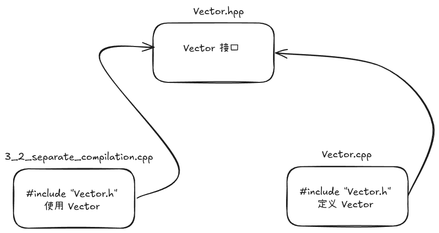

# 第 3 章 模块化

C++ 包含许多独立开发内容，为了清晰确定各个部件、组成、定义等，那么需要通过将每个部分的接口与实现分离开来。正如本项目正在做的，每个章节作为一个子项目，每个子项目中又包含
`include` 和 `src` 目录，分别用于存放接口和实现，最后通过 `CMakeLists.txt` 进行连接。

C++ 通过多种机制支持模块化编程，旨在提高代码的可维护性、可重用性并缩短编译时间。本章主要介绍分离编译、命名空间、函数参数与返回值和错误处理。

## 3.1 引言（Introduction）

---
模块化是有效管理大型项目的核心。C++ 传统上通过头文件和源文件实现分离编译，在语法层面 C++ 通过声明来表示接口。*声明*
指定了使用一个函数或一个类型所需的所有东西。但是注意：一个实体（如函数或类型）允许有很多声明，但只有一个定义。

## 3.2 分离编译（Separate Compilation）

---
何谓“分离编译”？即用户代码仅能看到所用类型和函数声明，而不必知道它们的具体实现。分离编译有两种实现方式：

- **头文件**：将声明放入独立文件，然后将头文件以文本方式包含进源文件中`#include`到代码中需要声明的地方。
- **模块**：定义`module`文件，独立地编译它们，然后需要时`import`它们。在`import`对应`module`时，只有其中显示`export`的声明才会被导出。

上述两种方式都是将一个程序组织划分开来，成为一组半独立代码片段。由此可以减少编译时间，同时强制性将程序中逻辑部分分离开来，降低发生错误概率。例如：库通常就是一组代码片段的集合。

使用头文件组织代码从C语言时代就存在，模块技术则是在C++20中出现的新特性，对比前者提供实质性的优势，对改善代码组织和编译耗时都有好处。但是非常可惜，在我编写该项目时，Linux平台下编译器对模块化支持还存在一些问题，原因在于clang与gcc的编译实现都还处于实验阶段。因此我暂时还是依旧使用头文件来组织，仅在模块化介绍时使用该特性。

程序组织的最佳实践是将一个完整的程序分成多个独立的部分，每个部分则包含一系列定义了良好依赖的模块集合，同时通过分离编译充分利用模块化。

一个可以单独编译的`.cpp`文件（包含其`#include`的头文件）被称为一个*翻译单元*。

在本示例 `Vector.cpp` 、`Vector.hpp` 及 `3_2_separate_compilation.cpp` 中，大致组织结构为：

头文件从C语言时代就开始，作为一种传统方法，它具有明显的缺点：

1. *编译时间*：如果存在许多的翻译单元，同时每个翻译单元中均包含`#include header.h`，那么编译器每次编译一个翻译单元都要编译
   `header.h`这个文本，这将会导致编译时间的增加。
2. *依赖顺序*：如果一个头文件中包含了另一个头文件，那么编译器将会按照`#include`
   的顺序依次编译它们。因此，如果一个头文件依赖于另一个头文件，那么必须保证该头文件在编译前被编译。
3. *不协调*：如果在一个文件中定义了一个实体，同时是在另一个文件中定义了一个稍微不同的实体，那么在我们有意或无意地在两个源文件中定义了同一个实体时，或者引用头文件顺序不一致时，可能导致程序崩溃或出现难以察觉的错误。
4. *传染性*：因为为了表达某个声明，其代码必须出现在头文件中，这一方面会导致代码膨胀；另一方面头文件为了完成声明必不可少的需要
   `#include`其他头文件，这会导致头文件用户（无论是有意还是无意）中依赖头文件包含的实现细节。

对此，在C++20中，**module**特性终于加入，让我们重新梳理上述例子。

### 示例：

在 `3_modularity` 示例中，我们将 `Vector` 类的声明放在 `Vector.hpp` 中，而将其实现放在 `Vector.cpp` 中。

代码参考：

- [Vector.hpp](../3_modularity/include/Vector.hpp)
- [Vector.cpp](../3_modularity/src/Vector.cpp)
- [3_2_separate_compilation.cpp](../3_modularity/src/3_2_separate_compilation.cpp)

## 3.3 命名空间（Namespaces）

---
命名空间用于将逻辑相关的组件组织在一起，并防止命名冲突。

- **定义**：使用 `namespace` 关键字。
- **使用**：通过作用域解析运算符 `::` 或 `using` 指令。

### 示例函数：

- `tutorial_namespaces()`：演示了如何在自定义命名空间中定义类和函数，并进行调用。

代码参考：[3_3_namespaces.cpp](../3_modularity/src/3_3_namespaces.cpp)

## 3.4 函数参数与返回值（Function Arguments and Return Values）

---
本节介绍参数传递（传值、传引用、常量引用）以及结构化绑定的基本用法。

### 示例函数：

- `tutorial_function_arguments_and_return_values()`：演示参数传递与结构化绑定。

代码参考：[3_4_function_arguments_and_return_values.cpp](../3_modularity/src/3_4_function_arguments_and_return_values.cpp)